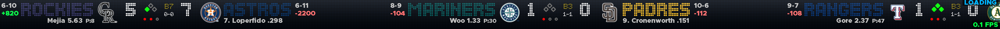
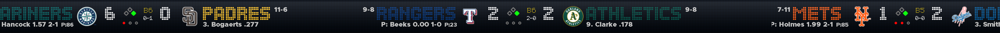

# MLB-TCKR

**Professional MLB Live Game Ticker for Windows**

A sleek, performant scrolling ticker that displays live Major League Baseball game data at the top of your screen — just like the tickers you see on sports networks and in sports bars.


---

## Screenshots

**Live games — in-progress with scores, runners, outs, pitcher info, and odds:**


**Multi-game view with team colors, logos, and real-time score data:**


---

## Features

### 🎯 Live Game Data
- **Real-time scores** from MLB-StatsAPI with **score change glow** — updated numbers glow gold (#FFD700) for 2.5 seconds, then fade back to white
- **Runners on base** displayed as bright green diamonds
- **Outs count** shown as bright red circles
- **Inning indicator** with Top/Bottom format (T5, B5) or Final (F)
- **Team logos** for all 30 MLB teams
- **Official team colors** with custom override support
- **Pitcher info** for live and pre-game: `P: Name ERA W-L` format
- **Moneyline odds** displayed inline next to each matchup (requires free Odds API key)

### 🔔 Watched Team Alerts
- **Select any of the 30 MLB teams** to watch from Settings → Alerts tab
- **Scoring alerts** — full-viewport Sweep Reveal animation fires whenever a watched team scores or an opponent scores against them
  - Alert text auto-fits the bar: `YANKEES SCORE  Judge: Home Run (2 RBI)`
  - Gold scanner beam sweeps right→left against a translucent team-colour background
  - Text pulses gently during the hold phase, then fades out
- **Game-start alerts** — `GAME STARTING  YANKEES vs METS` fires as the game goes live
  - Uses home team colour; if only the away team is watched, uses away team colour
- **Game-final alerts** — `FINAL  YANKEES DEFEAT METS  10-1` fires when the game ends
  - Always uses the winning team’s colour regardless of which team is watched
- **Alert duration** configurable from 3–15 seconds (default 6 s)
- **Multiple alerts** queue up and play sequentially with a 300 ms gap between each
- **De-duplication** prevents the same scoring play from triggering twice across poll cycles

### ⚡ Performance Optimized
- **60 FPS rendering** for silky smooth scrolling
- **Sub-pixel accuracy** eliminates visible stepping
- **Background threading** prevents interruptions during data fetches
- **Intelligent polling** — live games update every 10s, finished days switch to idle checks
- **Cached rendering** reduces CPU usage
- **Optional Cython optimization** for maximum performance
- **Hardware acceleration** with SmoothPixmapTransform
- **Pause stability** — scroll position preserved precisely when paused during data updates

### � TV / Radio / SiriusXM Schedule
- **Full broadcast info** for every game today or tomorrow — press **M** or right-click the tray → **TV/Radio Today…**
- **TV channels** displayed as away | home call signs (e.g. SCHN | CLEG); national broadcasts highlighted in gold
- **Radio stations** with frequencies (e.g. `WFAN 660/101.9 FM`, `WTAM 1100`) — generic network names and app-only entries automatically filtered
- **SiriusXM** satellite channel (home feed) and app channels for both teams on every applicable game
- **Today / Tomorrow toggle** — switch between today's and tomorrow's broadcast schedules with one click
- **Team logos** next to team names, colored in each team's official color
- **Parallel fetch** — MLB Stats API and SiriusXM page load simultaneously for fast display
- **Fully resizable** frameless window with 8-direction edge/corner drag resize and custom LED-style border

### �📊 Standings Window
- **Full AL/NL standings** in a sleek LED-style popup window
- **American League** (bright red) and **National League** (bright blue) — click to switch
- **Three division columns** (East / Central / West) with fixed-width table alignment
- **Per-team rows**: logo, colored nickname, W-L, Pct., Last 10
- **Background fetch** — non-blocking, loads while window is open
- **Draggable**, frameless, always-on-top; auto-centers on screen
- Access via system tray → **Standings...** or press **S**

### 📅 Day Navigation
- **Yesterday / Today / Tomorrow** modes accessible from the tray menu
- **Yesterday mode** shows ALL games — including west coast games that finished late
- In-progress games in yesterday mode continue to receive live updates
- **LOADING indicator** only appears on startup or when switching days — not on periodic refreshes

### ⌨️ Keyboard Shortcuts

> Click the ticker bar to give it focus first.

| Key | Action | Persists? |
|-----|--------|-----------|
| `Q` | Quit application | — |
| `S` | Open Standings window | — |
| `M` | Open TV / Radio / XM Schedule | — |
| `.` | Open Settings dialog | — |
| `P` | Pause / unpause scroll | — |
| `G` | Refresh game data now | no |
| `R` | Restart ticker (replay intro animation) | no |
| `Y` | Switch to Yesterday's games | no |
| `D` | Pin to Today / return to auto-mode | no |
| `T` | Switch to Tomorrow's games | no |
| `F` | Toggle FPS overlay | no |
| `+` or `=` | Increase scroll speed by 1 (max 30) | no |
| `-` | Decrease scroll speed by 1 (min 1) | no |
| `1` – `4` | Move ticker to that monitor number | no |

Shortcuts marked **no** are session-only and do not write to the settings file.

### 🎨 Customizable Appearance
- **LED-style gradient background** with glass overlay effect
- **Adjustable transparency** (0–255 opacity)
- **Custom team colors** — override any team's color
- **Multiple font options** with live in-dropdown preview (each name shown in its own typeface)
- **Configurable ticker height** (40–200 pixels)
- **Hover-to-pause** — ticker freezes when mouse is over it
- **Startup intro animation** — pixel-reveal block effect with MLB logo and app name

### 💰 Moneyline Odds
- **Live moneyline odds** displayed inline next to each game — e.g., `+820` / `-2200`
- Fetched from **The Odds API** (free tier available)
- Configurable refresh interval (default: every 15 minutes)
- Shown for pre-game and live games; hidden once a game is final
- Requires a free API key from [the-odds-api.com](https://the-odds-api.com)
- Enable in Settings → Odds tab; enter your API key and set refresh frequency

### ⚙️ Flexible Configuration
- **Scroll speed control** (1–30)
- **Update interval** (5–300 seconds)
- **Toggle display options**:
  - Team records (W-L)
  - Team cities vs nicknames only
  - Final games
  - Scheduled games
- **Moneyline odds** with configurable refresh interval
- **Settings persist** across sessions

### 🖥️ Windows Integration
- **AppBar integration** — docks persistently at top of screen, DPI-aware (works at 100%, 125%, 150%, 200% display scaling)
- **System tray icon** with quick access menu
- **Stays on top** of all windows

---

## Requirements

- **Operating System**: Windows 10/11
- **Python**: 3.13
- **Dependencies**:
  - `statsapi` — MLB game data
  - `PyQt5` — GUI framework
  - `Cython` (optional) — performance optimizations

---

## Installation

### 1. Clone or Download
```bash
git clone https://github.com/yourusername/MLB-TCKR.git
cd MLB-TCKR
```

### 2. Install Dependencies
```powershell
pip install -r requirements.txt
```

### 3. Setup Assets
The ticker automatically creates its data directory at `%APPDATA%\MLB-TCKR\`:
- `MLB-TCKR.images\` — Place team logo PNG files here (e.g., `yankees.png`, `dodgers.png`)
- `led_board-7.ttf` — Custom LED font (optional)
- `mlb.png` — System tray icon (optional)
- `MLB-TCKR.Settings.json` — Auto-generated on first run

### 4. Run
```powershell
python MLB-TCKR.py
```

---

## Performance Build (Optional)

For maximum smoothness, compile the Cython optimizations:

```powershell
.\build_performance.bat
```

This compiles the Cython module and automatically reads the version from `MLB-TCKR.py` to update all version resource files before building. The application falls back to pure Python if the Cython module is not present.

**Cython functions:**
- `calculate_smooth_scroll()` — Optimized scroll calculations
- `get_pixel_position()` — Fast float-to-int conversion
- `adjust_speed_for_framerate()` — FPS-aware speed scaling

**Performance targets:**
- With Cython: ~1–2% CPU, smooth 60 FPS
- Without Cython: ~3–5% CPU, smooth 60 FPS

---

## Usage

### System Tray Menu
Right-click the system tray icon to access:
- **Refresh Games** — Force immediate data update
- **Yesterday / Today / Tomorrow** — Switch day view
- **Standings...** — Open standings window
- **TV/Radio Today...** — Open TV / Radio / XM Schedule dialog
- **Settings** — Open settings dialog
- **Quit** — Exit the ticker

### Keyboard Shortcuts
See the full hotkeys table in the [Keyboard Shortcuts](#️⃣-keyboard-shortcuts) feature section above.

### Settings Dialog

#### General Tab
- **Ticker Speed** — Scroll speed (1–30)
- **Update Interval** — API call frequency in seconds (5–300)
- **Ticker Height** — Height in pixels (40–200)
- **Font** — Choose from available fonts with live preview
- **Display Options**:
  - Show Team Records (W-L)
  - Show Team Cities
  - Include Final Games
  - Include Scheduled Games
- **Visual Effects**:
  - LED-Style Background
  - Glass Overlay Effect
  - Background Opacity (0–255)
  - Content Opacity (0–255)

#### Odds Tab
- **Show Moneyline** — Toggle odds display on/off
- **Odds API Key** — Your key from [the-odds-api.com](https://the-odds-api.com)
- **Refresh Interval** — How often to fetch new odds in minutes (default: 15)

#### Alerts Tab
- **Alert Duration** — How long each alert displays (3–15 seconds)
- **Alert when watched team scores** — Full-viewport Sweep Reveal on scoring plays
- **Alert when opponent scores against watched team** — Also fires for opposition runs
- **Alert when watched team’s game starts** — Fires on status transition to In Progress
- **Alert when watched team’s game finishes** — Fires when game reaches Final
- **Watched Teams grid** — Select/deselect any of the 30 MLB teams; Select All / Clear All buttons

#### Team Colors Tab
- Customize the color for any team
- Color picker or hex input (`#RRGGBB`)
- Set to `1` to use the official MLB team color
- Reset to MLB official colors anytime
- Only modified colors are saved

#### Hotkeys Tab
- In-app reference of all keyboard shortcuts

---

## Project Structure

```
MLB-TCKR/
│
├── MLB-TCKR.py                    # Main application
├── mlb_ticker_utils_cython.pyx    # Cython optimizations source
├── setup_mlb_cython.py            # Cython build config
├── build_performance.bat          # Automated build + version extraction
├── requirements.txt               # Python dependencies
├── CHANGELOG.txt                  # Version history
├── README.md                      # This file
├── PERFORMANCE.md                 # Optimization guide
│
└── %APPDATA%\MLB-TCKR\            # User data directory
    ├── MLB-TCKR.Settings.json     # Settings file
    ├── led_board-7.ttf            # Custom font
    ├── mlb.png                    # Tray icon
    └── MLB-TCKR.images\           # Team logos
        ├── yankees.png
        ├── dodgers.png
        └── ... (30 teams)
```

---

## How It Works

### Data Flow
1. **Background Worker Thread** (`GameDataWorker`) fetches data from MLB-StatsAPI
2. **Signal/Slot Communication** passes game data to main UI thread
3. **Ticker Builder** creates a pixmap with all games (duplicated for seamless loop)
4. **60 FPS Animation** scrolls content smoothly with sub-pixel precision
5. **Intelligent Polling** adjusts update frequency based on game status

### Game States
- **Live/In Progress**: Scores, runners, outs, inning, pitcher info (updates every 10s)
- **Final/Completed**: Final scores with "F" indicator
- **Scheduled/Pre-Game**: Game time and probable pitchers

### Polling Intelligence
- **Active Games**: Updates every 10 seconds (configurable)
- **Warmup / Pre-Game**: Immediately exits idle mode; polls at the normal update interval
- **All Games Finished**: Switches to idle polling
- **Midnight Rollover**: Detects new day, fetches the next day’s schedule
- **Automatic Resume**: Returns to normal polling when games begin

### Baseball Diamond
- **Three Bases**: Triangle formation (1st, 2nd, 3rd)
  - Green (`#00FF00`) when runner is on base; gray outline when empty
- **Three Outs**: Circles below the bases
  - Red (`#FF0000`) for recorded outs; gray outline for remaining outs
- **Inning Indicator**: Gold text (`#FFD700`)
  - `T5` = Top of 5th, `B5` = Bottom of 5th, `F` = Final

### Score Change Glow
When a score updates, the changed number immediately switches to gold (`#FFD700`). After 2.5 seconds it returns to white. Away and home scores are tracked independently. The glow uses a high-precision elapsed timer and invalidates the render cache automatically to ensure smooth transitions.

### Moneyline Odds
Odds are fetched from [The Odds API](https://the-odds-api.com) on a configurable interval (default: 15 minutes). A free API account provides enough quota for a full season of use. Odds appear inline in the ticker as color-coded moneyline values (e.g., `+820` / `-2200`). Odds are shown for scheduled and live games and hidden once a game is final. Configure your API key and refresh rate in Settings → Odds tab.

---

## Moneyline Odds Setup

1. Sign up for a free account at [the-odds-api.com](https://the-odds-api.com)
2. Copy your API key from the dashboard
3. Open Settings (press `.`) → **Odds** tab
4. Paste your key into the **Odds API Key** field
5. Enable **Show Moneyline** and set your preferred **Refresh Interval**
6. Click OK — odds will appear on the next fetch

---

## Configuration Files

### Settings Location
`%APPDATA%\MLB-TCKR\MLB-TCKR.Settings.json`

### Example Settings
```json
{
    "speed": 6,
    "update_interval": 8,
    "ticker_height": 64,
    "font": "Ozone",
    "show_team_records": true,
    "show_team_cities": false,
    "include_final_games": true,
    "include_scheduled_games": true,
    "led_background": true,
    "glass_overlay": true,
    "background_opacity": 255,
    "team_colors": {
        "Rays": 1,
        "White Sox": "#3a3a3a",
        "Guardians": 1,
        "Tigers": 1,
        "Twins": 1,
        "Athletics": "#005045",
        "Mariners": 1,
        "Braves": 1,
        "Mets": 1,
        "Brewers": 1,
        "Pirates": "#ffee00",
        "Padres": 1
    },
    "font_scale_percent": 150,
    "show_fps_overlay": false,
    "use_proxy": false,
    "proxy": "",
    "use_cert": false,
    "cert_file": "",
    "monitor_index": 0,
    "player_info_font": "Metropolis Black",
    "content_opacity": 255,
    "load_at_startup": false,
    "player_font_scale_percent": 100,
    "yesterday_cutoff_minutes": 240,
    "show_moneyline": true,
    "odds_api_key": "",
    "odds_refresh_minutes": 15
}
```

### Key Settings Reference
| Key | Type | Description |
|-----|------|-------------|
| `speed` | int (1–30) | Scroll speed |
| `update_interval` | int (5–300) | Game data refresh in seconds |
| `ticker_height` | int (40–200) | Ticker bar height in pixels |
| `font` | string | Primary font name |
| `font_scale_percent` | int | Main font size scale % |
| `player_info_font` | string | Pitcher/player subtext font |
| `player_font_scale_percent` | int | Player font size scale % |
| `background_opacity` | int (0–255) | Background layer opacity |
| `content_opacity` | int (0–255) | Text/icon layer opacity |
| `monitor_index` | int | Target monitor (0 = primary) |
| `yesterday_cutoff_minutes` | int | Minutes past midnight to still show yesterday's games |
| `show_moneyline` | bool | Show/hide moneyline odds |
| `odds_api_key` | string | The Odds API key |
| `odds_refresh_minutes` | int | How often to refresh odds |
| `team_colors` | object | Per-team color overrides (`"#RRGGBB"` or `1` for official color) |
| `load_at_startup` | bool | Launch with Windows |
| `show_fps_overlay` | bool | Show FPS counter on ticker |

---

## Team Logos

Logo files go in `%APPDATA%\MLB-TCKR\MLB-TCKR.images\`. Use lowercase team nicknames with no spaces:

- `yankees.png`, `redsox.png`, `dodgers.png`, `whitesox.png`, `bluejays.png`, etc.

Case-insensitive lookup is used. If a logo is missing, the ticker falls back to a colored square with the team abbreviation.

---

## Troubleshooting

### Ticker doesn't appear
- Check if another window is in fullscreen mode
- Restart the application
- Verify Windows AppBar registration in console output

### Logos don't show
- Ensure PNG files are in `%APPDATA%\MLB-TCKR\MLB-TCKR.images\`
- Check file naming (lowercase team nickname, no spaces)
- Colored fallback squares will be used if logos are missing

### Scrolling is choppy
- Run `build_performance.bat` to enable Cython optimizations
- Close resource-heavy applications
- Reduce ticker height in settings

### Games not updating
- Check internet connection
- Verify MLB-StatsAPI is accessible
- Try manual refresh from the tray menu or press `R`

### Settings don't save
- Ensure `%APPDATA%\MLB-TCKR\` is writable
- Check for JSON syntax errors in the settings file

---

## Development

### Main Classes
| Class | Description |
|-------|-------------|
| `MLBTickerWindow` | Main application window with DPI-aware AppBar integration |
| `GameDataWorker` | Background thread for MLB API calls |
| `StandingsWindow` | AL/NL standings popup with LED-style background |
| `_StandingsWorker` | Background thread for standings fetch |
| `TVScheduleWindow` | TV / Radio / SiriusXM broadcast schedule popup |
| `_TvScheduleWorker` | Background thread for broadcast + SiriusXM fetch |
| `FontPreviewDelegate` | Custom delegate for font combo box live previews |
| `SettingsDialog` | Configuration UI with tabbed layout |

### Key Methods
| Method | Description |
|--------|-------------|
| `fetch_todays_games()` | MLB API integration |
| `build_ticker_pixmap()` | Render complete ticker to pixmap |
| `build_game_pixmap()` | Render a single game segment with score glow |
| `draw_baseball_diamond()` | Render runners/outs diamond |
| `update_scroll()` | 60 FPS animation loop |
| `setup_appbar()` | DPI-aware Win32 AppBar registration |
| `_effective_fetch_date()` | Returns today's or yesterday's date based on mode |
| `_invalidate_glow_cache()` | Triggers rebuild while score glow is active |

### Build System
- `build_performance.bat` — Compiles Cython, extracts version from `MLB-TCKR.py` line 13, updates `version-mlb-tckr.txt` automatically
- `setup_mlb_cython.py` — Distutils configuration with MSVC optimizations

---

## License

**GNU Affero General Public License v3.0 (AGPL-3.0)**

This program is free software: you can redistribute it and/or modify it under the terms of the GNU Affero General Public License as published by the Free Software Foundation, either version 3 of the License, or (at your option) any later version.

This program is distributed in the hope that it will be useful, but WITHOUT ANY WARRANTY; without even the implied warranty of MERCHANTABILITY or FITNESS FOR A PARTICULAR PURPOSE. See the GNU Affero General Public License for more details.

You should have received a copy of the GNU Affero General Public License along with this program. If not, see <https://www.gnu.org/licenses/>.

---

## Author

**Paul R. Charovkine**

- Program: MLB-TCKR
- Version: 1.5.3
- Date: 2026.04.30

---

## Acknowledgments

- **MLB-StatsAPI** — MLB game data provider
- **PyQt5** — Cross-platform GUI framework
- **Cython** — Python to C compiler for optimizations
- **LED Board-7 Font** — Custom LED-style font for authentic ticker appearance

---

## Support

For issues, questions, or feature requests:
1. Check `CHANGELOG.txt` for version history and known issues
2. Review `PERFORMANCE.md` for optimization guidance
3. Check console output for detailed error messages
4. Verify all dependencies are installed via `pip install -r requirements.txt`
- [ ] Expanded statistics display
- [ ] Multi-monitor support
- [ ] Custom positioning (top/bottom/left/right)
- [ ] Additional visual themes
- [ ] Playoff bracket visualization
- [ ] Player statistics integration
- [ ] Audio alerts for favorite teams

---

**Enjoy your MLB ticker! ⚾**
